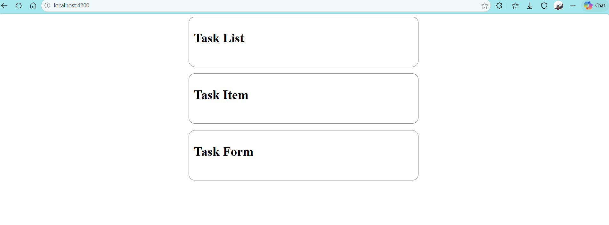
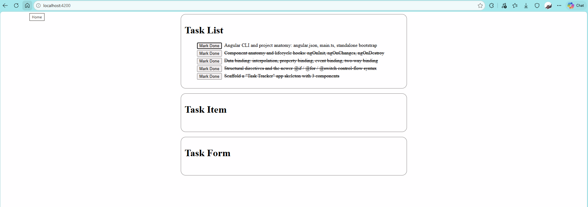

# TaskTracker
## Week 0
### Hands-on 1
Run `ng new task-tracker` (standalone, no routing yet). Generate three components: TaskList, TaskItem, and TaskForm, each just rendering a placeholder heading for now.

Done when: `ng serve` shows all three component placeholders rendered on one page.
Result:

### Hands-on 2
In TaskListComponent, hardcode an array of 5 sample tasks ({id, title, done}) directly in the class. Render them with @for, show the title via interpolation, apply a strikethrough style with [class.done], and add a button with (click) that toggles a task's done flag.

Done when: Clicking the button visually strikes through and un-strikes the task title, driven entirely by binding — no page reload.

Result:

